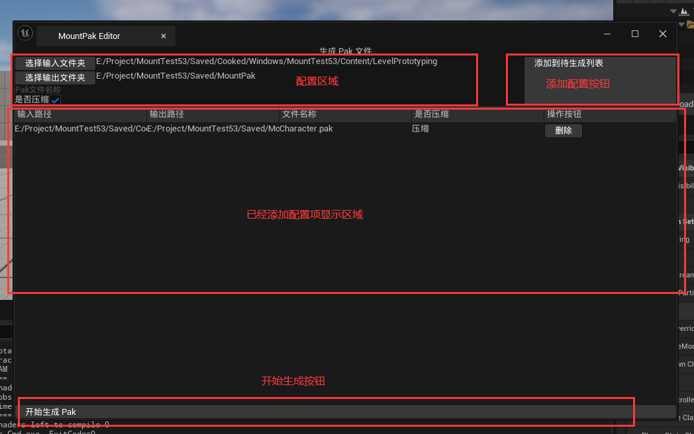
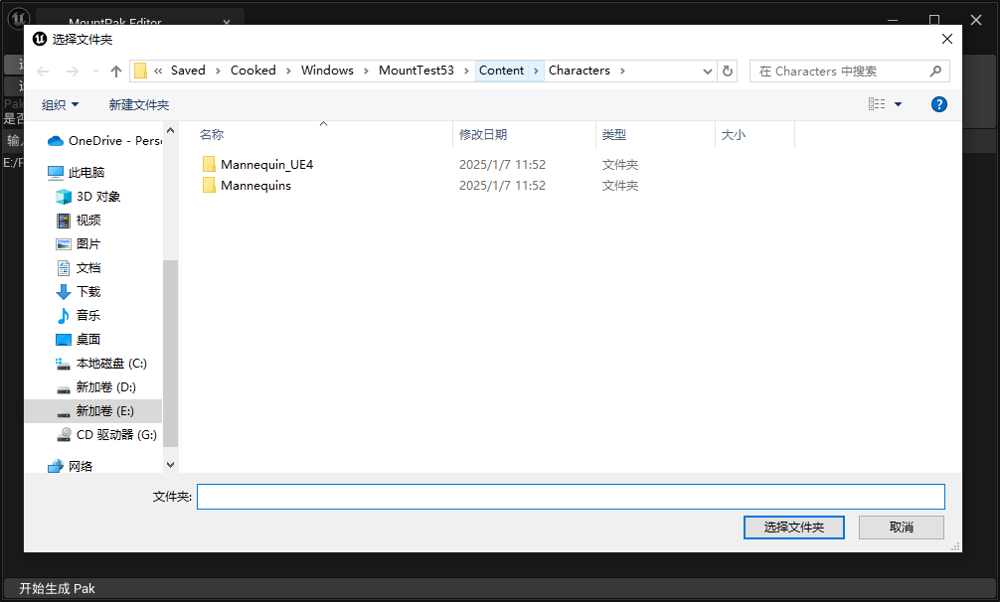

# README

这是一个实验性质的插件，小组自己捣鼓的下载和热更新插件

## 热更新

### 生成 PAK

可以使用 `UnrealPak.exe` 来创建 `.pak` 文件，然后动态的挂在这个 `Pak` 文件到游戏中，就可以实现动态添加内容到游戏中

首先创建一个 `txt` 文件用于标记哪些文件需要被打包到 `.pak` 文件中，大概内容如下

```bash
"F:\3_UEDemo\MountTest\Saved\Cooked\Windows\MountTest\Content\Mount\Level2.uexp" "../../../MountTest/Content/Mount/Level2.uexp" -compress
"F:\3_UEDemo\MountTest\Saved\Cooked\Windows\MountTest\Content\Mount\Level2.umap" "../../../MountTest/Content/Mount/Level2.umap" -compress
"F:\3_UEDemo\MountTest\Saved\Cooked\Windows\MountTest\Content\Mount\Mesh\M_MountTest.uasset" "../../../MountTest/Content/Mount/Mesh/M_MountTest.uasset" -compress
"F:\3_UEDemo\MountTest\Saved\Cooked\Windows\MountTest\Content\Mount\Mesh\M_MountTest.uexp" "../../../MountTest/Content/Mount/Mesh/M_MountTest.uexp" -compress
"F:\3_UEDemo\MountTest\Saved\Cooked\Windows\MountTest\Content\Mount\Mesh\Wall.uasset" "../../../MountTest/Content/Mount/Mesh/Wall.uasset" -compress
"F:\3_UEDemo\MountTest\Saved\Cooked\Windows\MountTest\Content\Mount\Mesh\Wall.ubulk" "../../../MountTest/Content/Mount/Mesh/Wall.ubulk" -compress
"F:\3_UEDemo\MountTest\Saved\Cooked\Windows\MountTest\Content\Mount\Mesh\Wall.uexp" "../../../MountTest/Content/Mount/Mesh/Wall.uexp" -compress
"F:\3_UEDemo\MountTest\Saved\Cooked\Windows\MountTest\Content\Mount\Blueprint\BP_MountTest_Actor.uasset" "../../../MountTest/Content/Mount/Blueprint/BP_MountTest_Actor.uasset" -compress
```

在 `UnrealPak.exe` 中可以通过 `-create` 字段来配置刚写好的 `txt` 文件

```bat
@echo off

@REM set UnrealPak="F:/UnrealLaunch/UE_5.3/Engine/Binaries/Win64/UnrealPak.exe"
set PATH=F:\UnrealLaunch\UE_5.3\Engine\Binaries\Win64;%PATH%
set InputTxtPath=%1
set OutputPakPath=%2
set RunPath=%CD%

if "%InputTxtPath%" == "" (
    set InputTxtPath=%RunPath%\CreatePakConfAndroid.txt
)

if "%OutputPakPath%" == "" (
    set OutputPakPath=%RunPath%\TestAndroid.pak
)

echo "UnrealPak Path => %UnrealPak%"
echo "InputTextPath => %InputTxtPath%"
echo "OutputPakPath => %OutputPakPath%"

UnrealPak.exe %OutputPakPath% -create=%InputTxtPath%

pause
```

其实可以通过 `F:\3_UEDemo\MountTest\Saved\Cooked\Windows\MountTest\Content\*.*` 代表 `Content` 目录下的所有资产

但是最后挂载的时候可能会出现一些问题，比如统一使用 `../../../ProjectName/Content` 作为挂载点

那么 `Conent/Mesh/M_Test.uasset` 这个资产会被挂载到 `../../../ProjectName/Content/M_Test.uasset` 这个路径上，最后通过路径进行 `load` 的时候就会因为找不到该资产而报错

一个文件一个文件的在 txt 中进行配置虽然繁琐，但是准确，而且所谓的繁琐只用编写脚本就可以一键导出

### 生成插件



插件分为三个区域
- 配置区域
- 已经添加的配置的显示区域
- 生成 Pak 文件按钮

点击 **选择输入文件夹** 和 **选择输出文件夹** 按钮会弹出 Windows 资源管理窗口，并将选择的文件夹路径显示到文本框中



`Unreal` 中打开文件选项窗口的代码如下

```cpp
FString OutFolderName;
FDesktopPlatformModule::Get()->OpenDirectoryDialog( FSlateApplication::Get().FindBestParentWindowHandleForDialogs(nullptr), TEXT(""), LastOutputDirectory, OutFolderName)
```

参数分别是 `ParentWindowHandle`、**弹出窗口的标题**、**弹出窗口的默认文件夹**、**选择的文件路径**

由于一般来说是将 `Cooked` 之后的资产进行打包，所以需要先 `Cooked Content`，因此在点击 **选择输入文件夹** 按钮的时候先检查是否存在 `Saved/Cooked` 文件夹

另外，如果存在多个相同**输出路径**和保存**文件名**的配置项，我认为是将多个**输入路径**下所有的资产都保存到同一个 Pak 文件中


关于生成 `Pak` 文件，直接运行 `UnrealPak.exe` 这个程序就好，`Unreal` 启动第三方进程的方法就是 `FMonitoredProcess`，给这个对象设置执行程序的 `URL` 和**参数**即可

```cpp
FString UnrealPakPath = FPaths::Combine(FPaths::EngineDir(), TEXT("Binaries"), TEXT("Win64"), TEXT("UnrealPak.exe"));
FString Params = SavePath + TEXT(" -create=") + TxtPath;
GeneratePakProcess = MakeShared<FMonitoredProcess>(UnrealPakPath, Params, true, true);
GeneratePakProcess->OnCanceled().BindRaw(this, &SGeneratePakTab::HandleGenerateProcessCanceled);
GeneratePakProcess->OnCompleted().BindRaw(this, &SGeneratePakTab::HandleGenerateProcessCompleted);
GeneratePakProcess->OnOutput().BindStatic(&SGeneratePakTab::HandleGenerateProcessOutput);
```

### 挂载

挂载的代码很简单，设置挂载**Pak文件路径** 和 **挂载点** 
 
通过得到 `FPakPlatformFile` 对象，可以方便的挂载 `Pak` 文件

```cpp
const FString PakFileName = TEXT("PakFile");
FPakPlatformFile* NewPakPlatformFile = static_cast<FPakPlatformFile*>(FPlatformFileManager::Get().FindPlatformFile(*PakFileName));
if (!NewPakPlatformFile)
{
	// Create a pak platform file and mount the feature pack file.
	NewPakPlatformFile = static_cast<FPakPlatformFile*>(FPlatformFileManager::Get().GetPlatformFile(*PakFileName));
	NewPakPlatformFile->Initialize(&FPlatformFileManager::Get().GetPlatformFile(), TEXT(""));
}

TRefCountPtr<FPakFile> PakFilePtr = new FPakFile(NewPakPlatformFile, *InPath, false);
FString PakMountPoint = PakFilePtr->GetMountPoint();

bool bMounted = false;

if (NewPakPlatformFile->Mount(*InPath, InPakOrder))
{
	UKismetSystemLibrary::PrintString(GetWorld(), TEXT("MountPoint ==> ") + PakMountPoint);
	
	TArray<FString> FileNames;
	PakFilePtr->GetPrunedFilenames(FileNames);
	for (const auto& ItemName : FileNames)
	{
		UKismetSystemLibrary::PrintString(GetWorld(), TEXT("\tItemName ==> ") + ItemName);
	}
}
```

除此之外，还有一种方法可以挂载 Pak 文件，那就是直接通过 `FCoreDelegates::MountPak` 来挂载

```cpp
if (FCoreDelegates::MountPak.IsBound())
{
    auto bSuccess = FCoreDelegates::MountPak.Execute(PakPath, PakReadOrder);

    // Do Something ....
}
```

在 `FPakPlatformFile` 类中，绑定了 `FCoreDelegates` 中一些 `Mount` 相关的事件，所以引擎中很多地方都是直接 `Execute` 这些事件

```cpp
FCoreDelegates::OnMountAllPakFiles.BindRaw(this, &FPakPlatformFile::MountAllPakFiles);
FCoreDelegates::MountPak.BindRaw(this, &FPakPlatformFile::HandleMountPakDelegate);
FCoreDelegates::OnUnmountPak.BindRaw(this, &FPakPlatformFile::HandleUnmountPakDelegate);
FCoreDelegates::OnOptimizeMemoryUsageForMountedPaks.BindRaw(this, &FPakPlatformFile::OptimizeMemoryUsageForMountedPaks);

FCoreDelegates::OnFEngineLoopInitComplete.AddRaw(this, &FPakPlatformFile::OptimizeMemoryUsageForMountedPaks);
```

## 下载

`HttpDownLoadTool` 插件用于下载指定网络路径下的文件，支持断点续传

对于服务来说要求支持 `Range`

可以使用 `npm install http-server` 来快速安装一个支持 `Range` 的简易 `Http` 请求文件的  `http-server` 库，然后通过 `npx http-server -p 8001` 来启动这个库，指定端口为 `8001`， 也就是可以通过 `http://127.0.0.1:8001` 来访问这个库

