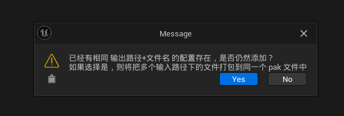

# README

这是一个实验性质的插件，小组自己捣鼓的下载和热更新插件

## 热更新

### 生成 PAK

可以使用 `UnrealPak.exe` 来创建 `.pak` 文件，然后动态的挂在这个 `Pak` 文件到游戏中，就可以实现动态添加内容到游戏中

首先创建一个 `txt` 文件用于标记哪些文件需要被打包到 `.pak` 文件中，大概内容如下

```bash
"F:\3_UEDemo\MountTest\Saved\Cooked\Windows\MountTest\Content\Mount\Level2.uexp" "../../../MountTest/Content/Mount/Level2.uexp" -compress
"F:\3_UEDemo\MountTest\Saved\Cooked\Windows\MountTest\Content\Mount\Level2.umap" "../../../MountTest/Content/Mount/Level2.umap" -compress
"F:\3_UEDemo\MountTest\Saved\Cooked\Windows\MountTest\Content\Mount\Mesh\M_MountTest.uasset" "../../../MountTest/Content/Mount/Mesh/M_MountTest.uasset" -compress
"F:\3_UEDemo\MountTest\Saved\Cooked\Windows\MountTest\Content\Mount\Mesh\M_MountTest.uexp" "../../../MountTest/Content/Mount/Mesh/M_MountTest.uexp" -compress
"F:\3_UEDemo\MountTest\Saved\Cooked\Windows\MountTest\Content\Mount\Mesh\Wall.uasset" "../../../MountTest/Content/Mount/Mesh/Wall.uasset" -compress
"F:\3_UEDemo\MountTest\Saved\Cooked\Windows\MountTest\Content\Mount\Mesh\Wall.ubulk" "../../../MountTest/Content/Mount/Mesh/Wall.ubulk" -compress
"F:\3_UEDemo\MountTest\Saved\Cooked\Windows\MountTest\Content\Mount\Mesh\Wall.uexp" "../../../MountTest/Content/Mount/Mesh/Wall.uexp" -compress
"F:\3_UEDemo\MountTest\Saved\Cooked\Windows\MountTest\Content\Mount\Blueprint\BP_MountTest_Actor.uasset" "../../../MountTest/Content/Mount/Blueprint/BP_MountTest_Actor.uasset" -compress
```

在 `UnrealPak.exe` 中可以通过 `-create` 字段来配置刚写好的 `txt` 文件

```bat
@echo off

@REM set UnrealPak="F:/UnrealLaunch/UE_5.3/Engine/Binaries/Win64/UnrealPak.exe"
set PATH=F:\UnrealLaunch\UE_5.3\Engine\Binaries\Win64;%PATH%
set InputTxtPath=%1
set OutputPakPath=%2
set RunPath=%CD%

if "%InputTxtPath%" == "" (
    set InputTxtPath=%RunPath%\CreatePakConfAndroid.txt
)

if "%OutputPakPath%" == "" (
    set OutputPakPath=%RunPath%\TestAndroid.pak
)

echo "UnrealPak Path => %UnrealPak%"
echo "InputTextPath => %InputTxtPath%"
echo "OutputPakPath => %OutputPakPath%"

UnrealPak.exe %OutputPakPath% -create=%InputTxtPath%

pause
```

其实可以通过 `F:\3_UEDemo\MountTest\Saved\Cooked\Windows\MountTest\Content\*.*` 代表 `Content` 目录下的所有资产

但是最后挂载的时候可能会出现一些问题，比如统一使用 `../../../ProjectName/Content` 作为挂载点

那么 `Conent/Mesh/M_Test.uasset` 这个资产会被挂载到 `../../../ProjectName/Content/M_Test.uasset` 这个路径上，最后通过路径进行 `load` 的时候就会因为找不到该资产而报错

一个文件一个文件的在 txt 中进行配置虽然繁琐，但是准确，而且所谓的繁琐只用编写脚本就可以一键导出

### 生成插件


插件分为三个区域
- 配置区域
- 已经添加的配置的显示区域
- 生成 Pak 文件按钮

点击 **选择输入文件夹** 和 **选择输出文件夹** 按钮会弹出 Windows 资源管理窗口，并将选择的文件夹路径显示到文本框中


`Unreal` 中打开文件选项窗口的代码如下

```cpp
FString OutFolderName;
FDesktopPlatformModule::Get()->OpenDirectoryDialog( FSlateApplication::Get().FindBestParentWindowHandleForDialogs(nullptr), TEXT(""), LastOutputDirectory, OutFolderName)
```

参数分别是 `ParentWindowHandle`、**弹出窗口的标题**、**弹出窗口的默认文件夹**、**选择的文件路径**

由于一般来说是将 `Cooked` 之后的资产进行打包，所以需要先 `Cooked Content`，因此在点击 **选择输入文件夹** 按钮的时候先检查是否存在 `Saved/Cooked` 文件夹

另外，如果存在多个相同**输出路径**和保存**文件名**的配置项，我认为是将多个**输入路径**下所有的资产都保存到同一个 Pak 文件中



关于生成 `Pak` 文件，直接运行 `UnrealPak.exe` 这个程序就好，`Unreal` 启动第三方进程的方法就是 `FMonitoredProcess`，给这个对象设置执行程序的 `URL` 和**参数**即可

```cpp
FString UnrealPakPath = FPaths::Combine(FPaths::EngineDir(), TEXT("Binaries"), TEXT("Win64"), TEXT("UnrealPak.exe"));
FString Params = SavePath + TEXT(" -create=") + TxtPath;
GeneratePakProcess = MakeShared<FMonitoredProcess>(UnrealPakPath, Params, true, true);
GeneratePakProcess->OnCanceled().BindRaw(this, &SGeneratePakTab::HandleGenerateProcessCanceled);
GeneratePakProcess->OnCompleted().BindRaw(this, &SGeneratePakTab::HandleGenerateProcessCompleted);
GeneratePakProcess->OnOutput().BindStatic(&SGeneratePakTab::HandleGenerateProcessOutput);
```

### 挂载

挂载的代码很简单，设置挂载**Pak文件路径** 和 **挂载点** 
 
通过得到 `FPakPlatformFile` 对象，可以方便的挂载 `Pak` 文件

```cpp
const FString PakFileName = TEXT("PakFile");
FPakPlatformFile* NewPakPlatformFile = static_cast<FPakPlatformFile*>(FPlatformFileManager::Get().FindPlatformFile(*PakFileName));
if (!NewPakPlatformFile)
{
	// Create a pak platform file and mount the feature pack file.
	NewPakPlatformFile = static_cast<FPakPlatformFile*>(FPlatformFileManager::Get().GetPlatformFile(*PakFileName));
	NewPakPlatformFile->Initialize(&FPlatformFileManager::Get().GetPlatformFile(), TEXT(""));
}

TRefCountPtr<FPakFile> PakFilePtr = new FPakFile(NewPakPlatformFile, *InPath, false);
FString PakMountPoint = PakFilePtr->GetMountPoint();

bool bMounted = false;

if (NewPakPlatformFile->Mount(*InPath, InPakOrder))
{
	UKismetSystemLibrary::PrintString(GetWorld(), TEXT("MountPoint ==> ") + PakMountPoint);
	
	TArray<FString> FileNames;
	PakFilePtr->GetPrunedFilenames(FileNames);
	for (const auto& ItemName : FileNames)
	{
		UKismetSystemLibrary::PrintString(GetWorld(), TEXT("\tItemName ==> ") + ItemName);
	}
}
```

除此之外，还有一种方法可以挂载 Pak 文件，那就是直接通过 `FCoreDelegates::MountPak` 来挂载

```cpp
if (FCoreDelegates::MountPak.IsBound())
{
    auto bSuccess = FCoreDelegates::MountPak.Execute(PakPath, PakReadOrder);

    // Do Something ....
}
```

在 `FPakPlatformFile` 类中，绑定了 `FCoreDelegates` 中一些 `Mount` 相关的事件，所以引擎中很多地方都是直接 `Execute` 这些事件

```cpp
FCoreDelegates::OnMountAllPakFiles.BindRaw(this, &FPakPlatformFile::MountAllPakFiles);
FCoreDelegates::MountPak.BindRaw(this, &FPakPlatformFile::HandleMountPakDelegate);
FCoreDelegates::OnUnmountPak.BindRaw(this, &FPakPlatformFile::HandleUnmountPakDelegate);
FCoreDelegates::OnOptimizeMemoryUsageForMountedPaks.BindRaw(this, &FPakPlatformFile::OptimizeMemoryUsageForMountedPaks);

FCoreDelegates::OnFEngineLoopInitComplete.AddRaw(this, &FPakPlatformFile::OptimizeMemoryUsageForMountedPaks);
```

## 下载

`HttpDownLoadTool` 插件用于下载指定网络路径下的文件，支持断点续传

### 思路

需要下载的文件可能是一个非常大的文件，比如 CG 动画、Cooked 之后的资源包 等等。这种大文件如果单独使用一个 Http 请求下载，如果出现网络波动导致文件下载失败，重新下载的代价是非常巨大的

想要解决这个问题，可以直接每次下载文件的一部分，比如以 1M 为单位，每次下载 1M，最后将所有下载的文件合并成一个真正的文件即可


### 关于分段下载

对于服务来说要求支持 `Range`

关于 `Range`，这个是 HTTP 提供的一个请求头，要求服务器仅回传 HTTP 消息的一部分。范围请求对于支持随机访问的媒体播放器、明确只需要大型文件莫部分的数据处理工具，以及允许用户暂停及恢复下载的下载管理器等客户端尤其有用

> MDN 关于 HTTP 范围请求的说明 `https://developer.mozilla.org/zh-CN/docs/Web/HTTP/Range_requests`

也就是说如果需要断点续传，这个 `Range` 的使用尤其重要

`curl http://i.imgur.com/z4d4kWk.jpg -i -H "Range: bytes=0-1023"` 以这段命令为例，在请求头中设置了 `Range` 值为 `bytes=0-1023` 表示请求 `z4d4kWk.jpg` 这个文件的前 1024 个字节的内容

> 支持多段请求 `Range: bytes=0-50, 100-150`

可以使用 `npm install http-server` 来快速安装一个支持 `Range` 的简易 `Http` 请求文件的  `http-server` 库，然后通过 `npx http-server -p 8001` 来启动这个库，指定端口为 `8001`， 也就是可以通过 `http://127.0.0.1:8001` 来访问这个库

也可以使用 `Nginx` 作为静态资源服务器，只需要在配置文件中添加 `add_header Accept-Ranges bytes;` 即可支持 `Range`


### 关于下载

为了分段下载，首先得知道需要下载的文件的大小，知道大小才能根据文件大小和每次下载的数据量，来拆分不同的 `Request` 请求

可以指定请求类型为 `HEAD` 来获取指定 `URL` 文件的一些头信息

```cpp
FileSizeRequest = FHttpModule::Get().CreateRequest();
if (FileSizeRequest)
{
	FileSizeRequest->SetURL(URL);
	FileSizeRequest->SetVerb(TEXT("HEAD"));
	// https://blog.csdn.net/lotluck/article/details/78486279
	// HTTP中的Range就是分段请求字节数 Range: bytes=0-0 可以探测获取文件大小
	// FileSizeRequest->SetHeader(TEXT("Range"), TEXT("bytes=0-0"));
	FileSizeRequest->OnProcessRequestComplete().BindUObject(this, &UAsyncDownloadFile::ReponseFileSize);
	FileSizeRequest->ProcessRequest();
}
```

在 `Response` 中，返回头中有一个名为 `Content-Length` 的头，存储着文件大小信息

```cpp
FString RangeStr = HttpResponse->GetHeader("Content-Length");
```

然后根据文件大小、每次大小的大小，拆分成多个任务

```cpp
while (StartSize < TotalFileSize)
{
	// 创建子任务
	int64 TempSize = 0;

	FString TempRange;
	if (StartSize + TaskSize <= TotalFileSize)
	{
		TempSize = TaskSize;
		TempRange = FString::Printf(TEXT("bytes=%lld-%lld"), StartSize, StartSize + TempSize - 1);
	}
	else
	{
		TempSize = TotalFileSize - StartSize;
		TempRange = FString::Printf(TEXT("bytes=%lld-"), StartSize);
	}

	UE_LOG(LogTemp, Log, TEXT(" \r\n \t Download SubTask \t TaskId = %lld, TaskRange = %s, Size = %lld, URL = %s"), TaskID, *TempRange, TempSize, *URL);
	
    // 创建下载任务，设置下载链接、大小、请求头信息
	
	StartSize += TempSize;
	++TaskID;
}
```

通过 Unreal 原生支持的 http 请求，配合 `Range`，即可从 `Response` 获取下载的指定大小的文件内容

为了解决下载文件重名问题，可以使用下载链接生成唯一的 md5 码，然后以 md5 码作为下载文件的文件名

比如下载链接是 `http://127.0.0.1/downloadfile.mp4`，通过下载链接可以生成唯一的 md5 码，然后以 md5 码作为下载的文件 ID，可以避免下载到不同网址但是同名的文件进而导致 Bug

```cpp
FString MD5Hash = FMD5::HashAnsiString(Url)
```

可以一次起多个 `Request` 来加快下载速度，给每个 `Request` 指定不同的 `Range`

```cpp
RequestPtr = FHttpModule::Get().CreateRequest();
RequestPtr->SetURL(URL);
RequestPtr->SetVerb(TEXT("GET"));
RequestPtr->SetHeader(TEXT("Range"), Range);
```

### 关于断点续传


以一个 44M 的 PDF 为例

下载路径为 `http://127.0.0.1:8080/download.pdf`，大小 44M，每个下载请求为 1M，共计出现 44 个下载任务

每个下载任务设置下载 ID， ID 从 0 开始，也就是说 ID 的值是 0 ~ 43 

根据 `http://127.0.0.1:8080/download.pdf` 生成 MD5 为 `849ed761b73f37586031bb270b1eb6e0`，那么每个下载任务下载的片段为 `849ed761b73f37586031bb270b1eb6e0_37` + ID + `.hcf`

> `.hcf` 下载后缀自定义，意义不大


最后得到的结果就是上图所示的内容，总共创建了 44 个 `hcf` 文件，和一个合并得到的 `download.pdf` 文件


如果中途退出游戏，那么下次重新请求的时候，可以先判断 `.hcf` **文件是否存在**，比如 `849ed761b73f37586031bb270b1eb6e0_4.hcf` 文件存在，则表示 ID = 4 的下载任务已经完成，无需再次发出 HTTP 请求了

